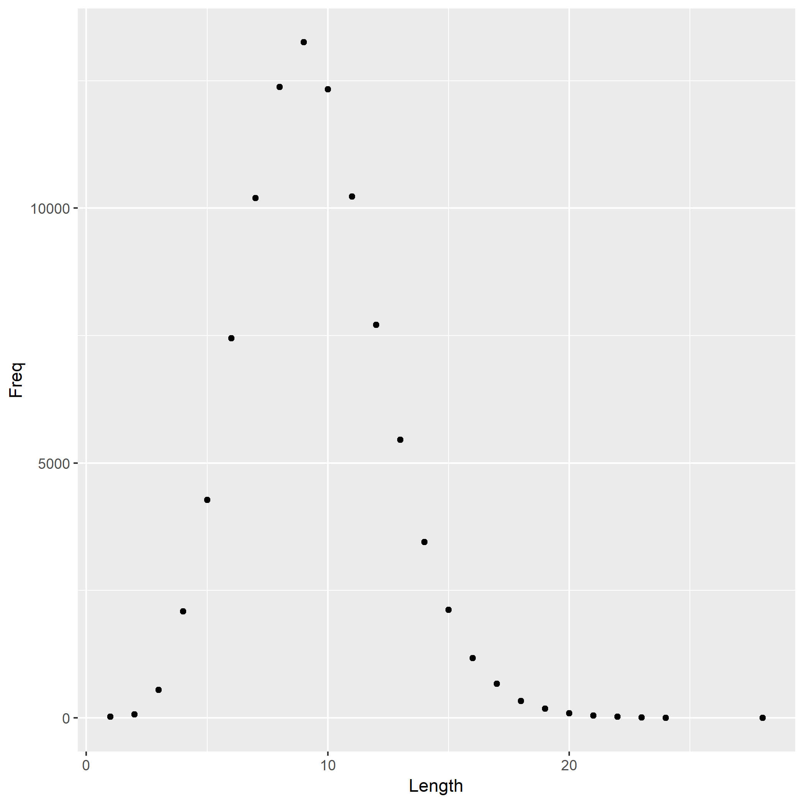
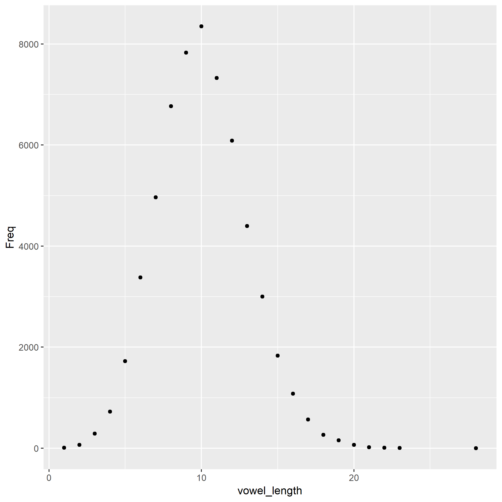
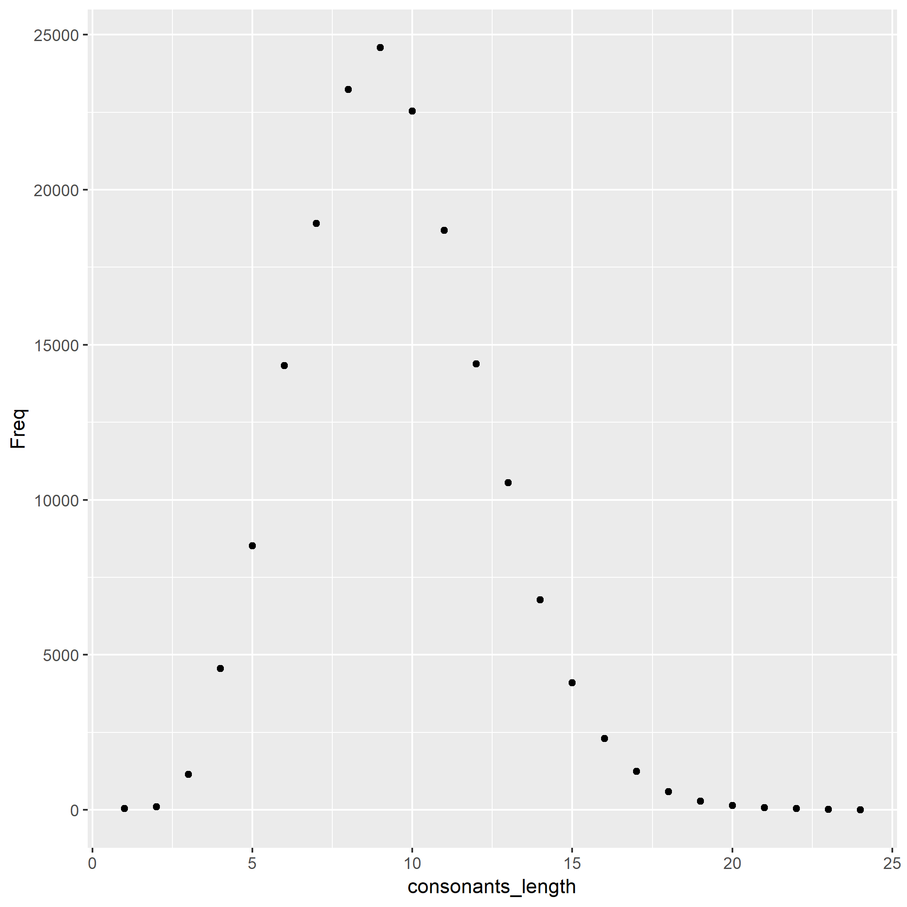

The file "words.txt" contains a bunch of words. On my machine, it contains 94067 words.

I computed the length of each word, i.e. the number of characters, and tabulated how many words consist of 1 character, 2 characters, etc.

The most frequent word length is 9.

Here is a histogram of word lengths.

From here I wanted to see what is the average length of word starting with a vowel or a consonant.

There are 29422 words that start with a vowel.

The most frequent word length of words starting with a vowel is 10

There are 64645 words that start with a consonant.

The most frequent word length of words starting with a consonant is 9

