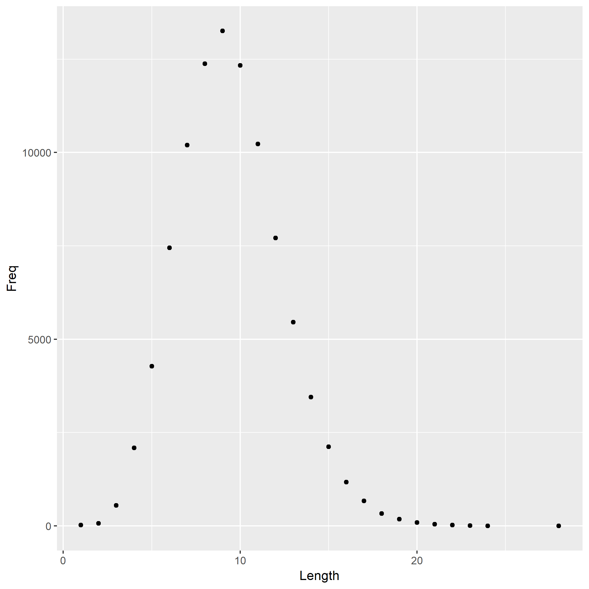
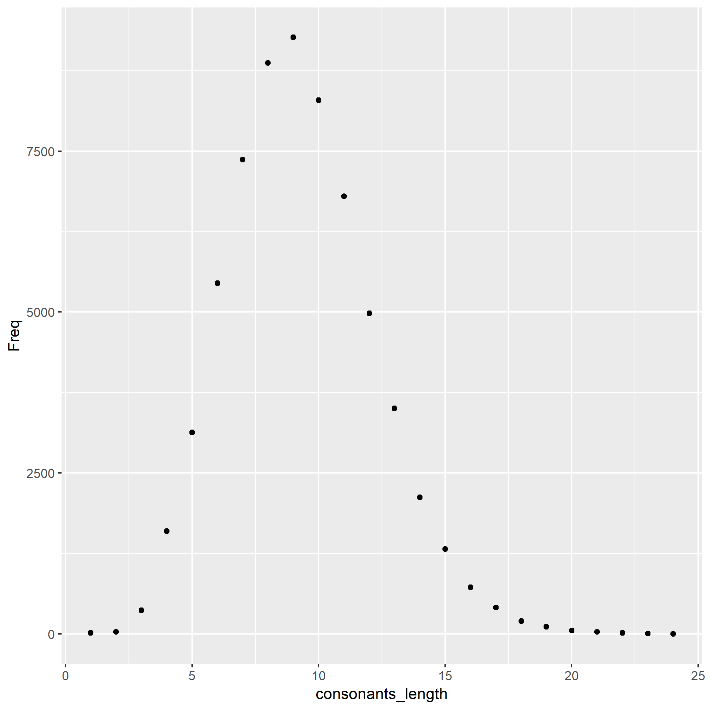

```{r load-hist-dat, include = FALSE}
hist_dat <- read.delim("histogram.tsv")
vowel_dat <- read.delim("vowels.tsv")
consonants_dat <- read.delim("consonants.tsv")
```

The file "words.txt" contains a bunch of words. On my machine, it contains `r sum(hist_dat$Freq)` words.

I computed the length of each word, i.e. the number of characters, and tabulated how many words consist of 1 character, 2 characters, etc.

The most frequent word length is `r with(hist_dat, Length[which.max(Freq)])`.

Here is a histogram of word lengths.



From here I wanted to see what is the average length of word starting with a vowel or a consonant.

There are `r sum(vowel_dat$Freq)` words that start with a vowel.

The most frequent word length of words starting with a vowel is `r with(vowel_dat, vowel_length[which.max(Freq)])`


There are `r sum(consonants_dat$Freq)` words that start with a consonant.

The most frequent word length of words starting with a consonant is `r with(consonants_dat, consonants_length[which.max(Freq)])`

